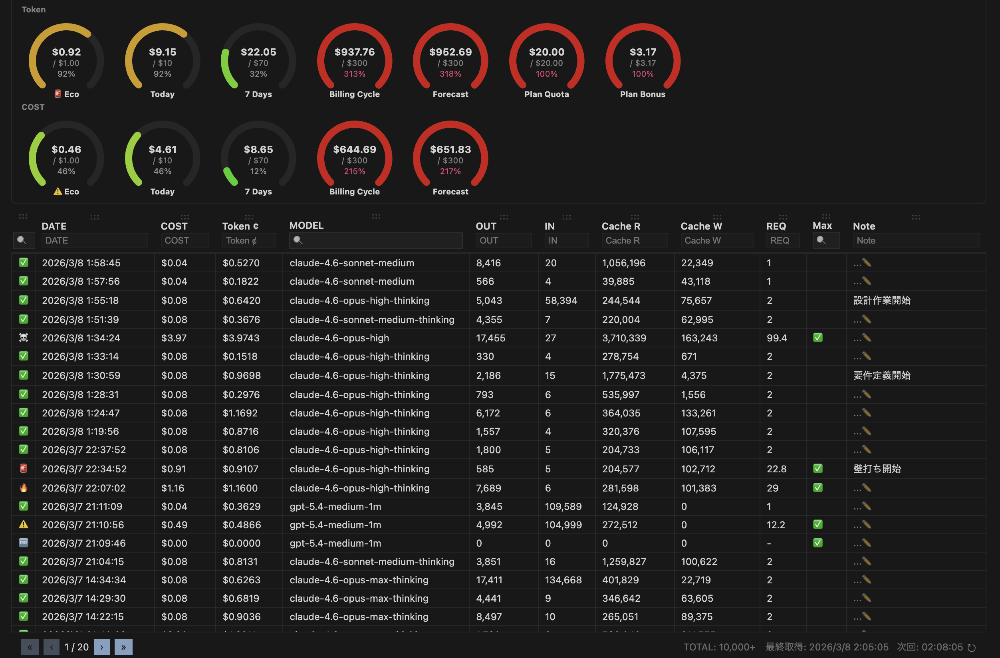

# Cursor Economizer

> **Cursor の利用料金を確認・分析する拡張機能**

Track your Cursor AI usage costs with detailed breakdowns, billing cycle tracking, and memo support.

## Quick Setup

### 1. セッショントークンを取得

1. [cursor.com/dashboard](https://cursor.com/dashboard) にログイン
2. `F12` → **Application** → **Storage** → **Cookies** → `https://cursor.com`
3. `WorkosCursorSessionToken` の値をコピー

### 2. インストール・設定

1. Marketplace または Open VSX からインストール
2. コマンドパレットで `Cursor Economizer: トークン設定` を実行
3. コピーしたトークンを貼り付け
4. ステータスバーに利用状況が表示されます

## Features

- **ステータスバー表示** — 課金サイクル内の利用率・累積金額をリアルタイム表示
- **詳細テーブル** — TanStack Table による全イベント一覧（フィルタ・ソート・ページネーション）
- **6メーターダッシュボード** — Eco / Free Quota / Today / 7 Days / Billing Cycle / Forecast
- **メモ機能** — 各利用レコードにメモを追加・編集（日本語 IME 対応）
- **自動更新** — 設定可能な間隔で自動データ取得（1〜15分）
- **SQLite 永続化** — ローカル DB に保存、複数ウィンドウ間で同期
- **自動データ削除** — 保持日数を設定して古いデータを自動クリーンアップ
- **i18n** — 英語 / 日本語対応

## Commands

| コマンド | 説明 |
|---|---|
| `Cursor Economizer: データ取得` | 最新の利用データを取得 |
| `Cursor Economizer: トークン設定` | セッショントークンを設定 |
| `Cursor Economizer: トークン削除` | 保存済みトークンを削除 |
| `Cursor Economizer: 詳細を開く` | 詳細テーブルビューを表示 |

## Configuration

### 一般

| 設定 | 説明 | デフォルト |
|---|---|---|
| `autoRefreshEnabled` | 自動更新の有効/無効 | `true` |
| `autoRefreshIntervalMinutes` | 自動更新間隔（分、1〜15） | `3` |
| `autoDeleteDays` | データ自動削除（日数、0で無効） | `90` |

### 目標

| 設定 | 説明 | デフォルト |
|---|---|---|
| `ecoMeterThreshold` | エコメーター閾値（$、0.1〜3.0） | `1` |
| `dailyUsageGoal` | 日次利用目標額（$、0で無制限） | `10` |
| `monthlyBudgetGoal` | 月間予算目標額（$、0で無制限） | `300` |

### テーブル

| 設定 | 説明 | デフォルト |
|---|---|---|
| `pageSize` | 1ページあたりの表示行数 | `500` |

### カラム表示

| 設定 | 説明 | デフォルト |
|---|---|---|
| `columns.kind.visible` | KIND カラムを表示 | `false` |
| `columns.maxMode.visible` | MAX カラムを表示 | `false` |
| `columns.tokenBased.visible` | TOKEN BASED カラムを表示 | `false` |
| `columns.chargeable.visible` | CHARGEABLE カラムを表示 | `false` |
| `columns.headless.visible` | HEADLESS カラムを表示 | `false` |
| `columns.user.visible` | USER カラムを表示 | `false` |
| `columns.fee.visible` | FEE カラムを表示 | `false` |

## Troubleshooting

**「トークンが設定されていません」** → Quick Setup の手順でトークンを設定してください  
**「データ取得エラー」** → ネットワーク接続を確認し、cursor.com にログインした状態でトークンを再取得してください  
**「データが表示されない」** → Cursor AI を使用した後、手動でデータ取得を実行してください

## Contributing

コントリビューションを歓迎します。

1. リポジトリをフォーク
2. フィーチャーブランチを作成: `git checkout -b feature/amazing-feature`
3. 変更をコミット: `git commit -m 'feat: add amazing feature'`
4. プルリクエストを作成

## License

MIT

## Privacy

セッショントークンはローカルの SecretStorage にのみ保存されます。  
ログ・設定画面・Webview にトークンが露出することはありません。  
拡張は Cursor の API と直接通信します。

## Roadmap

今後のリリースで以下の機能を予定しています。

- **CSV ダウンロード** — 利用データを CSV 形式でエクスポート
- **コストタグ** — タグを設定し、タグ別にコストを集計・分類

要望や優先度のフィードバックは [Issue](https://github.com/cursor-tool/cursor-economizer/issues) で受け付けています。

## Support This Project

この拡張機能が役に立ったら、開発の継続を支援していただけると嬉しいです。

<!-- TODO: 寄付リンクを設定後に置き換える -->
- [Buy Me a Coffee](https://buymeacoffee.com/<your-id>)
- [GitHub Sponsors](https://github.com/sponsors/<your-id>)

寄付は任意です。機能やサポート優先度には影響しません。
