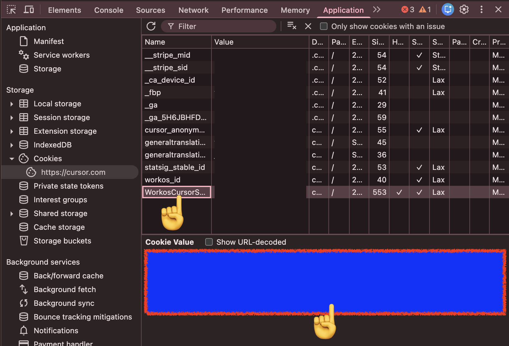
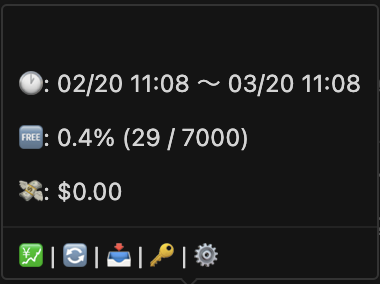
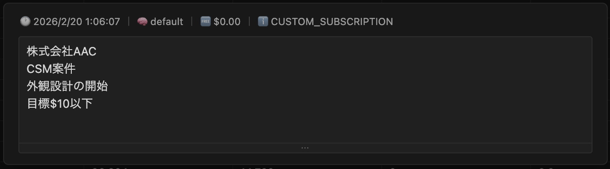

# Cursor Economizer

> Cursor の利用料金を確認・分析する VS Code 拡張機能
>
> VS Code extension to track and analyze your Cursor AI usage costs.

---

## セットアップ

## Setup

### 1. トークン取得

### 1. Get Token

[cursor.com/dashboard](https://cursor.com/dashboard) → `F12` → **Application** → **Cookies** → `WorkosCursorSessionToken` をコピー

Copy the `WorkosCursorSessionToken` cookie value from [cursor.com/dashboard](https://cursor.com/dashboard).

### 2. トークン設定

### 2. Set Token

以下のいずれかでトークンを設定できます。  
Set your token using either method:

- コマンドパレット → `Cursor Economizer: トークン設定`  
  Command Palette → `Cursor Economizer: Set Token`
- ステータスバーのツールチップ → 🔑  
  Status bar tooltip → 🔑

### 3. メニューアクセス

### 3. Menu Access

ステータスバーにマウスオーバーすると、各コマンドにアクセスできます。  
Hover over the status bar to access all commands.

💹 詳細 | 🔄️ 更新 | 🔑 トークン設定 | 📥 CSV エクスポート | ⚙️ 設定

ツールチップの `⚙️` から、表示カラムの増減ができます。  
You can increase or decrease visible columns from tooltip `⚙️`.

> トークンは SecretStorage に暗号化保存されます。設定画面・ログ・Webview に露出しません。  
> Token is encrypted in SecretStorage. Never exposed in settings, logs, or Webview.

---

## 機能

## Features

- **ステータスバー** — 利用率・累積金額をリアルタイム表示 **Status Bar** — Real-time usage rate and cost display
- **詳細テーブル** — フィルタ・ページネーション付きイベント一覧 **Detail Table** — Event list with filter and pagination
- **列幅・列順序変更** — ドラッグでリサイズ・並べ替え **Column Resize & Reorder** — Drag to resize or reorder columns
- **6メーターダッシュボード** — Eco / Free Quota / Today / 7 Days / Billing Cycle / Forecast **6-Meter Dashboard** — Eco / Free Quota / Today / 7 Days / Billing Cycle / Forecast
- **メモ機能** — 各レコードにメモを追加・編集（IME 対応） **Memo** — Add/edit memo per record (IME-friendly)
- **自動更新** — 1〜15分間隔で自動データ取得 **Auto Refresh** — Automatic data fetch at 1–15 min intervals
- **SQLite 永続化** — ローカル DB、複数ウィンドウ間同期 **SQLite Persistence** — Local DB, synced across windows
- **自動データ削除** — 保持日数指定で古いデータを自動削除 **Auto Cleanup** — Auto-delete old data by retention days
- **i18n** — 日本語 **i18n** — English

---

## ステータスバー

## Status Bar

ステータスバーに直近リクエストの情報を表示します。クリックで手動更新。  
Shows the latest request info. Click to manually refresh.

### 表示形式

### Format

`{emoji} {cost} | {tokens} | Req {request_cost}`

### コスト絵文字

### Cost Emoji

| Emoji | Condition    | Status (日本語) | Status (English) |
| ----- | ------------ | --------------- | ---------------- |
| 💎    | INCLUDED     | プラン内利用    | Included in plan |
| 🆓    | $0           | 無料            | Free             |
| ✅    | < $0.20      | 低コスト        | Low              |
| ⚠️    | $0.20–$0.50  | 注意            | Caution          |
| 🚨    | $0.50–$1.00  | 警告            | Warning          |
| 🔥    | $1.00–$3.00  | 高コスト        | High             |
| ☠️    | $3.00–$10.00 | 超高コスト      | Very High        |
| 🥶    | > $10.00     | 危険            | Critical         |
| ❌    | ERRORED      | エラー          | Error            |

---

## 詳細テーブル

## Detail Table

コマンドパレット → `Cursor Economizer: 詳細を開く`、またはツールチップの `💹 詳細` でテーブルを表示。  
Open the table from Command Palette → `Cursor Economizer: Open Detail`, or tooltip `💹 Detail`.

| 操作       | Operation  | 方法                         | Method                      |
| ---------- | ---------- | ---------------------------- | --------------------------- |
| フィルタ   | Filter     | ヘッダー入力欄               | Header input                |
| ページ切替 | Pagination | テーブル下部                 | Table footer                |
| 列幅変更   | Resize     | ヘッダー境界ドラッグ         | Drag header border          |
| 列順序変更 | Reorder    | ヘッダーD&D                  | Drag and drop header        |
| メモ編集   | Edit Memo  | MEMO 列クリック → Enter 保存 | Click MEMO then press Enter |
| データ更新 | Refresh    | 右下の更新ボタン             | Bottom-right refresh button |

### メモ機能

### Memo Feature

メモは各利用レコードに保存できます。案件名・目的・注意点などを残せます。  
You can save notes per usage record for project names, goals, and reminders.

MEMO 列をクリックして編集し、エリア外クリックで保存、`Escape` でキャンセルします。  
Click the MEMO column to edit, click outside to save, or press `Escape` to cancel.

---

## コマンド

## Commands

| Command                           | 説明             | Description       | ツールチップ / Tooltip |
| --------------------------------- | ---------------- | ----------------- | ---------------------- |
| `Cursor Economizer: データ取得`   | データ取得       | Fetch latest data | 🔄️                     |
| `Cursor Economizer: トークン設定` | トークン設定     | Set token         | 🔑                     |
| `Cursor Economizer: トークン削除` | トークン削除     | Delete token      | -                      |
| `Cursor Economizer: 詳細を開く`   | 詳細テーブル表示 | Open detail table | 💹                     |

---

## 設定

## Configuration

### 一般

### General

| Setting                      | 説明                      | Description               | Default |
| ---------------------------- | ------------------------- | ------------------------- | ------- |
| `autoRefreshEnabled`         | 自動更新                  | Auto refresh              | `true`  |
| `autoRefreshIntervalMinutes` | 更新間隔（1〜15分）       | Interval (1–15 min)       | `3`     |
| `autoDeleteDays`             | 自動削除（日数、0で無効） | Auto delete (days, 0=off) | `90`    |

### 目標

### Goals

| Setting             | 説明             | Description                     | Default |
| ------------------- | ---------------- | ------------------------------- | ------- |
| `ecoMeterThreshold` | エコメーター閾値 | Eco meter threshold ($)         | `1`     |
| `dailyUsageGoal`    | 日次目標         | Daily goal ($, 0=unlimited)     | `10`    |
| `monthlyBudgetGoal` | 月間予算         | Monthly budget ($, 0=unlimited) | `300`   |

### テーブル

### Table

| Setting    | 説明     | Description   | Default |
| ---------- | -------- | ------------- | ------- |
| `pageSize` | 表示行数 | Rows per page | `500`   |

### カラム表示

### Column Visibility

| Setting                      | Column      | 説明     | Description       | Default |
| ---------------------------- | ----------- | -------- | ----------------- | ------- |
| `columns.kind.visible`       | KIND        | 種別     | Kind              | `false` |
| `columns.maxMode.visible`    | MAX         | MAXモード | Max mode          | `false` |
| `columns.tokenBased.visible` | TOKEN BASED | トークン課金 | Token-based       | `false` |
| `columns.chargeable.visible` | CHARGEABLE  | 課金対象 | Chargeable        | `false` |
| `columns.headless.visible`   | HEADLESS    | ヘッドレス | Headless          | `false` |
| `columns.user.visible`       | USER        | ユーザー | User              | `false` |
| `columns.fee.visible`        | FEE         | 手数料   | Fee               | `false` |

---

## トラブルシューティング

## Troubleshooting

| 症状             | Symptom       | 対処                                  | Solution                           |
| ---------------- | ------------- | ------------------------------------- | ---------------------------------- |
| トークン未設定   | Token not set | Setup の手順でトークンを設定          | Follow setup steps                 |
| データ取得エラー | Fetch error   | cursor.com にログイン後トークン再取得 | Re-login and get a new token       |
| データ未表示     | No data       | Cursor AI 使用後に手動取得            | Manual fetch after using Cursor AI |

---

## 変更追随ポリシー

## Fast Update Policy

Cursor のプラン増設・構成変更には、できるだけ早く追随します。  
We aim to quickly follow Cursor plan expansions and structural changes.

仕様変更の影響で表示や集計に差分が出る場合があります。  
Spec changes may temporarily affect display or aggregation.

その際、ユーザーから情報提供をいただけると修正がさらに速くなります。  
When users share details, we can deliver fixes even faster.

### ご協力のお願い

### How You Can Help

- 新しいレスポンス JSON（機密情報をマスクしたサンプル） New response JSON sample (with sensitive data masked)
- 発生日時、利用プラン、再現手順 Time of occurrence, plan type, and reproduction steps
- どの画面で、何が、どう変わったか（スクリーンショット歓迎） What changed, where it changed, and screenshots if possible

提供いただいた情報は、プラン変更への迅速な追随にのみ利用します。  
Shared information is used only to accelerate compatibility updates.

報告・情報提供は [Issue](https://github.com/cursor-tool/cursor-economizer/issues) で受け付けています。  
Please report and share details via [Issue](https://github.com/cursor-tool/cursor-economizer/issues).

---

## Contributing

コントリビューション歓迎。  
Contributions welcome.

1. Fork → `git checkout -b feature/amazing-feature` → PR

## License

MIT

## プライバシー

## Privacy

トークンは SecretStorage のみに保存。外部送信なし。  
Token stored only in SecretStorage. No external transmission.

## Roadmap

- ~~**CSV エクスポート**~~ ✅ v0.1.4
- **コストタグ** — タグ別コスト集計  
  **Cost Tags** — Categorized cost tracking

[Issue](https://github.com/cursor-tool/cursor-economizer/issues) でフィードバック受付中。  
Feedback welcome via Issues.

## Support This Project

- [GitHub Sponsors](https://github.com/sponsors/cursor-tool)

寄付は任意です。  
Donations are optional.
